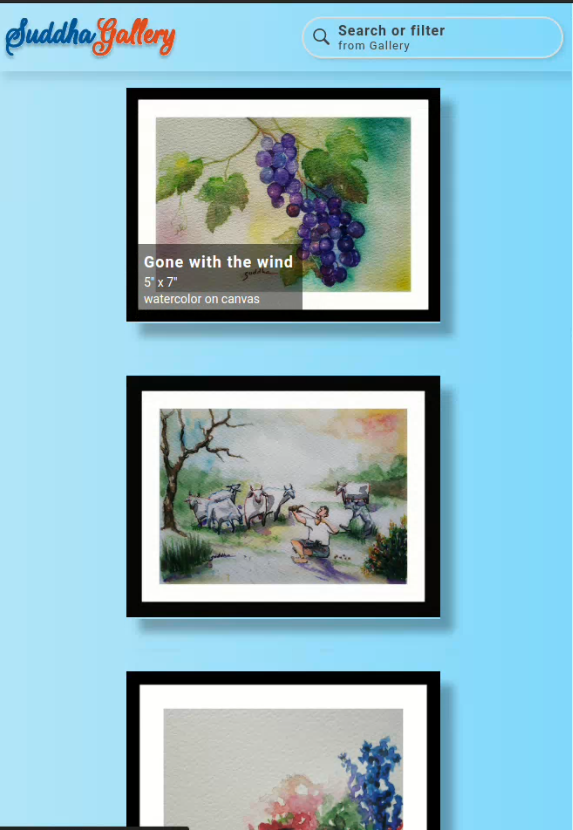
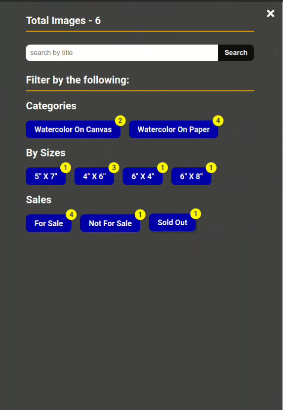
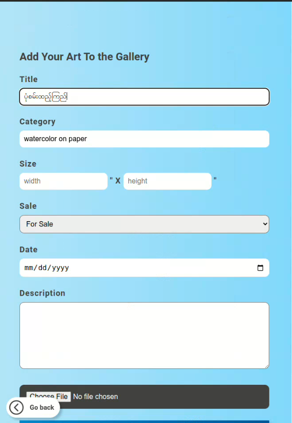
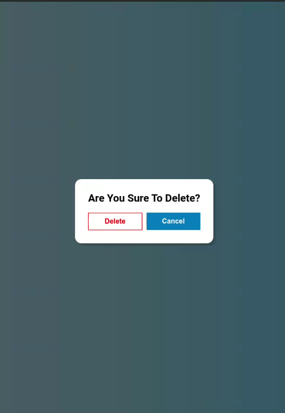
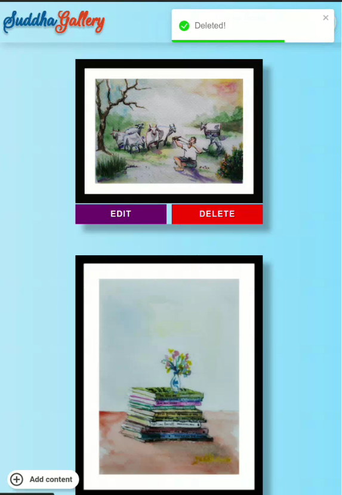
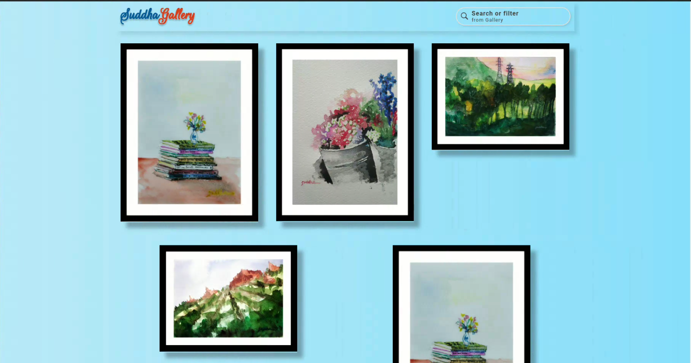

# My First Full Stack Website

## Demo

- [Suddha Art Gallery](https://suddha-art-gallery.web.app/)

## Description

- simple gallery website
- user can see the photo that admin was uploaded
- user can filter the images by category, sale and size
- user can search the images with title
- admin can post, update, and delete the photos.
- images count stats automatically update after add, deleting and updating.

## Build with

Front End

- **React**
- **SCSS**

Backend and Authentication

- **Firebase/Firestore**
- **Firebase/Auth**
- **Firebase/Storage**

## Screenshots

